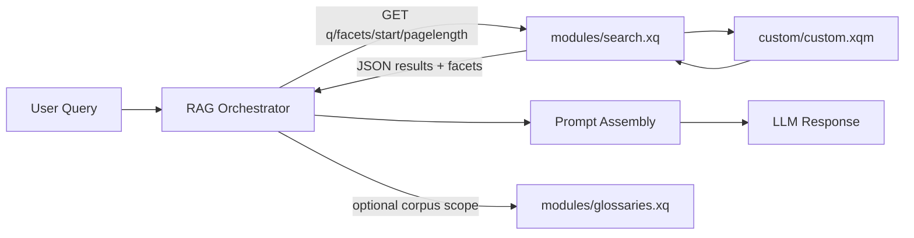

# RAG-Ready Taxonomy Search Template (eXist-db + SKOS/SKOS-XL)

This repository is a template application for building taxonomy-first search experiences on eXist-db that can serve as retrieval infrastructure for RAG pipelines.

It includes a working implementation for glossary and concept navigation using SKOS/SKOS-XL RDF data, while emphasizing production-ready retrieval and customization patterns.

## Purpose

- Provide a reusable eXist-db taxonomy search skeleton (XQuery backend + web frontend).
- Support ingestion and management of multiple SKOS/SKOS-XL glossaries as retrieval corpora.
- Demonstrate configurable faceting, relationship-aware navigation, and concept detail retrieval.
- Make domain customization straightforward without rewriting core search plumbing.
- Enable clean downstream handoff of search results to RAG orchestration layers.

## What This Template Implements

- `Search UI`: Lit 3 frontend with debounced query search, facets, paging, and detail expansion.
- `Taxonomy Relations`: Related/Broader/Narrower controls that update search state.
- `Admin UI`: upload/delete glossary data and inspect loaded glossaries.
- `eXist-db APIs`: XQuery modules for search, upload, delete, auth identity, and glossary listing.
- `RAG-Oriented Retrieval`: structured concept payloads designed to be repurposed for grounding/context assembly.
- `Packaging`: build to an installable `.xar` archive for eXist-db package manager.

## Why This Is RAG-Ready

- `Grounded retrieval`: concept lookups are anchored to controlled taxonomy entities instead of raw keyword snippets.
- `Relationship-aware expansion`: broader/narrower/related links help build richer context windows for LLM prompts.
- `Facet filtering`: narrows retrieval to domain-specific slices before prompt construction.
- `Custom mapping hook`: `src/main/xquery/modules/custom/custom.xqm` lets you shape output payloads for downstream embedding/reranking/generation workflows.

## RAG Integration Blueprint

Use this app as the retrieval layer in a larger RAG stack.



### Retrieval Endpoints

- `GET modules/search.xq`
  - Query params: `q`, `facets`, `start`, `pagelength`, optional `debug`
  - Returns JSON: `{ total, available, facets, results }`
- `GET modules/glossaries.xq`
  - Returns available glossary names for corpus scoping/filter UX.

### Search Request Example

```http
GET /exist/apps/<your-app>/modules/search.xq?q=aberration&start=1&pagelength=10
Accept: application/json
```

Facet-constrained example:

```http
GET /exist/apps/<your-app>/modules/search.xq?q=aberration&facets=Glossary:IVOAT&start=1&pagelength=10
Accept: application/json
```

### Search Response Shape (Example)

```json
{
  "total": 1,
  "available": 1234,
  "facets": [
    {
      "name": "Glossary",
      "values": [
        {
          "facet": "Glossary",
          "value": "Glossary:IVOAT",
          "name": "IVOAT",
          "count": 1,
          "selected": false
        }
      ]
    }
  ],
  "results": [
    {
      "index": 1,
      "concept": {
        "term": "aberration",
        "about": "#aberration",
        "definition": ["aberration of light"],
        "altLabel": null,
        "related": [
          {
            "name": "astrometry",
            "glossary": "Glossary:IVOAT",
            "label": "Preferred%20Label:astrometry"
          }
        ],
        "broader": [],
        "narrower": []
      },
      "snippets": ["<div>...kwic snippet...</div>"],
      "uri": "xmldb:exist:///.../data/IVOAT/Concept-aberration.xml",
      "glossary": "IVOAT",
      "score": 0.73
    }
  ]
}
```

### How To Plug Into a RAG Service

1. Receive the user question in your orchestrator service.
2. Call `modules/search.xq` with `q` and optional `facets`.
3. Build context blocks from `results[].concept` and `results[].snippets`.
4. Optionally expand/cluster context using `related`, `broader`, and `narrower` links.
5. Pass grounded context to your LLM prompt template.

## Selected Architecture

- `Backend`: XQuery modules in `src/main/xquery/modules/`
  - `search.xq`, `upload.xq`, `delete.xq`, `glossaries.xq`, `who-am-i.xq`
  - `custom/custom.xqm` for project-specific mapping/query behavior
- `Public frontend`: Lit app in `src/main/lit/base/`
  - root app: `src/main/lit/base/src/emh-accelerator-app.ts`
- `Admin frontend`: Lit app in `src/main/lit/admin/`
- `Static/resources`: `src/main/resources/`
  - package metadata: `src/main/resources/expath-pkg.xml`, `src/main/resources/repo.xml`
  - eXist collection config: `src/main/resources/collection.xconf`
- `Build`: Gradle orchestrates npm + Vite builds and XAR assembly via `build.gradle`

## Versioning and Package Sync

- The package version is defined once in `src/main/resources/expath-pkg.xml` (`@version`).
- `build.gradle` reads that value and uses it in the generated XAR filename.
- Result: `expath-pkg.xml` metadata and built XAR filename stay in sync automatically.

## Requirements

- Java 21+ (required for eXist-db 7.x testing)
- eXist-db 7.0.0-beta3+ (package metadata requires `semver-min=7.0.0-beta3`)
- Node.js 20+ and npm
- Gradle wrapper in repo (`./gradlew`)

## Compatibility Matrix

| Runtime | Status | Notes |
|---|---|---|
| eXist-db 6.4.1 + Java 17 | Known baseline | Prior baseline for current packaging; keep as fallback during migration. |
| eXist-db 7.0.0-beta3 + Java 21 | Current evaluation target | Best beta to validate migration and RAG retrieval behavior. |
| eXist-db 7.0.0-beta1 / beta2 | Do not target directly | Superseded by beta3; no app-specific benefit to pin older betas. |

> eXist-db 7.0.0 betas are prerelease software. Validate with backups and smoke tests before using outside test environments.

## Build and Package

```bash
cd /Users/lcahlander/IdeaProjects/emh-exist-glossary
./gradlew buildXAR
```

Output:
- XAR file in `build/` named `magellan-glossary-<version>.xar`
- where `<version>` is read from `src/main/resources/expath-pkg.xml`

Clean build artifacts and frontend build directories:

```bash
cd /Users/lcahlander/IdeaProjects/emh-exist-glossary
./gradlew clean
```

Run migration preflight checks for eXist-db 7 beta environments:

```bash
cd /Users/lcahlander/IdeaProjects/emh-exist-glossary
./gradlew beta3Preflight
```

To include deployed endpoint smoke tests in that task, pass the deployment URL:

```bash
cd /Users/lcahlander/IdeaProjects/emh-exist-glossary
./gradlew beta3Preflight -PsmokeBaseUrl="http://localhost:8080/exist/apps/magellan-glossary"
```

## Install in eXist-db

1. Start eXist-db and open the dashboard.
2. Go to Package Manager.
3. Upload the built XAR from `build/`.
4. Open the installed app from the launcher.

Run endpoint smoke tests against your deployed app:

```bash
cd /Users/lcahlander/IdeaProjects/emh-exist-glossary
python3 tools/exist_smoke_test.py --base-url "http://localhost:8080/exist/apps/magellan-glossary"
```

Optional auth for admin endpoint checks:

```bash
cd /Users/lcahlander/IdeaProjects/emh-exist-glossary
python3 tools/exist_smoke_test.py --base-url "http://localhost:8080/exist/apps/magellan-glossary" --username "admin" --password "<password>"
```

Run an explicit pagination/facet regression scenario (useful during eXist-db 7 migration):

```bash
cd /Users/lcahlander/IdeaProjects/emh-exist-glossary
python3 tools/exist_smoke_test.py --base-url "http://localhost:8080/exist/apps/magellan-glossary" --regression-query "aberration" --regression-page-length 5
```

## Template Customization Guide

When adapting this repo to a new domain, focus on these extension points first:

- `Search behavior and result payload`: `src/main/xquery/modules/custom/custom.xqm`
- `Collection indexing and full-text behavior`: `src/main/resources/collection.xconf`
- `Result card rendering`: `src/main/lit/base/src/result-item.ts`
- `Top-level search interactions/state`: `src/main/lit/base/src/emh-accelerator-app.ts`

Recommended customization workflow:

1. Replace sample/source data with your RDF datasets.
2. Adjust extraction/mapping logic in `custom.xqm`.
3. Tune index config in `collection.xconf` for your fields/facets.
4. Update result display components and labels.
5. Rebuild XAR and test search/facets in eXist-db.

Detailed step-by-step checklist:

- `docs/CUSTOMIZATION-CHECKLIST.md`

Architecture and request/data flow:

- `docs/ARCHITECTURE.md`

## SKOS/SKOS-XL Implementation Notes

- The admin flow supports uploading RDF glossaries.
- The app demonstrates concepts and semantic relationships used in SKOS/SKOS-XL:
  - preferred labels
  - alternative labels
  - broader / narrower / related links
- Sample files are provided in `samples/`.

Validate RDF/XML inputs before upload:

```bash
cd /Users/lcahlander/IdeaProjects/emh-exist-glossary
python3 tools/rdf_compat_check.py samples/*.rdf
```

## Authentication and Authorization

- Search is available to guest users.
- Administrative actions are gated by eXist-db user/group membership.
- Admin access is surfaced in the UI when the logged-in user belongs to the expected admin groups.

## Repository Layout

```text
src/main/xquery/modules/     XQuery endpoints and custom search logic
src/main/lit/base/           Public Lit frontend
src/main/lit/admin/          Admin Lit frontend
src/main/resources/          eXist package metadata and static resources
samples/                     Example RDF/SKOS/SKOS-XL inputs
tools/                       Utility scripts (RDF compatibility checks)
build.gradle                 Build orchestration and XAR packaging
```

## Project Positioning

This project is intentionally both:

- a `template` for RAG-ready taxonomy search applications, and
- a `reference implementation` of SKOS/SKOS-XL concept search/management.

You can keep the architecture and replace the domain model, or keep the glossary model and tailor behavior/UI for your organization.

## Built With GitHub Copilot

Parts of this project were developed and refined with assistance from GitHub Copilot.

## License

This project is open source under the MIT License. See `LICENSE`.

