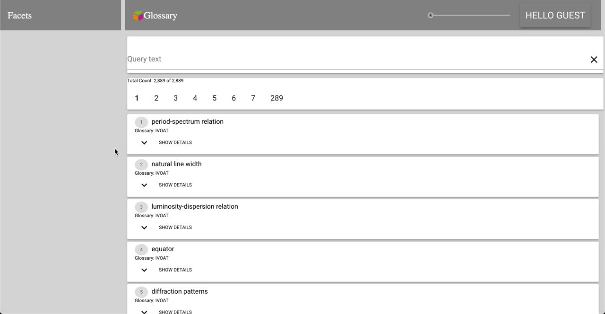
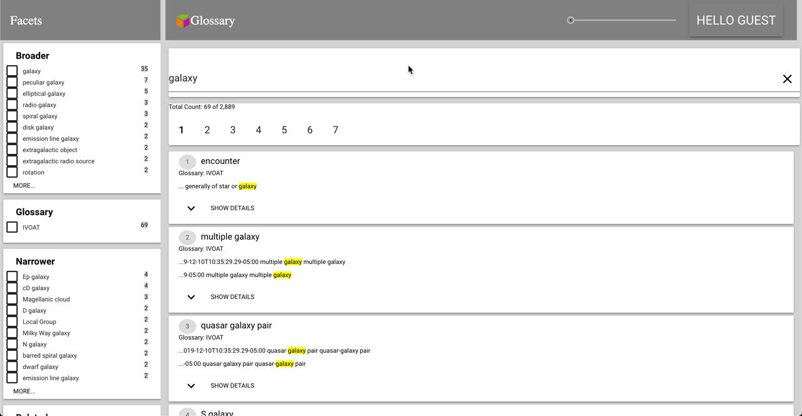
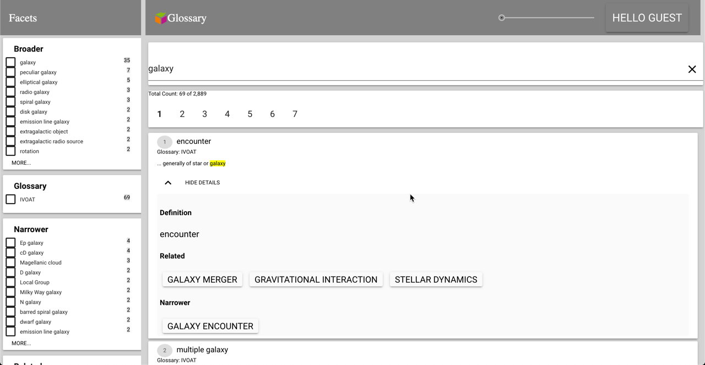
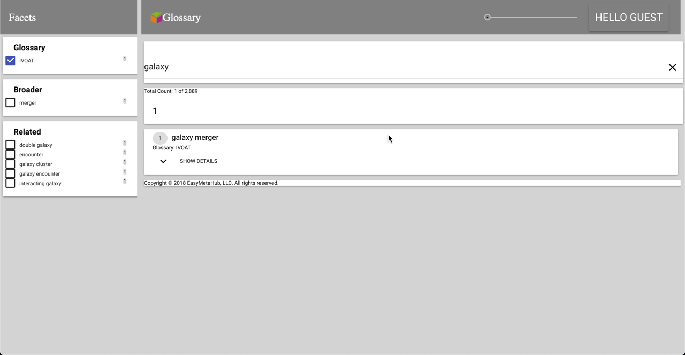
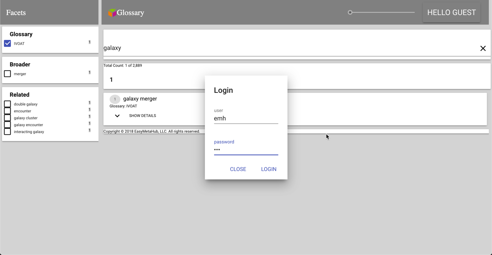
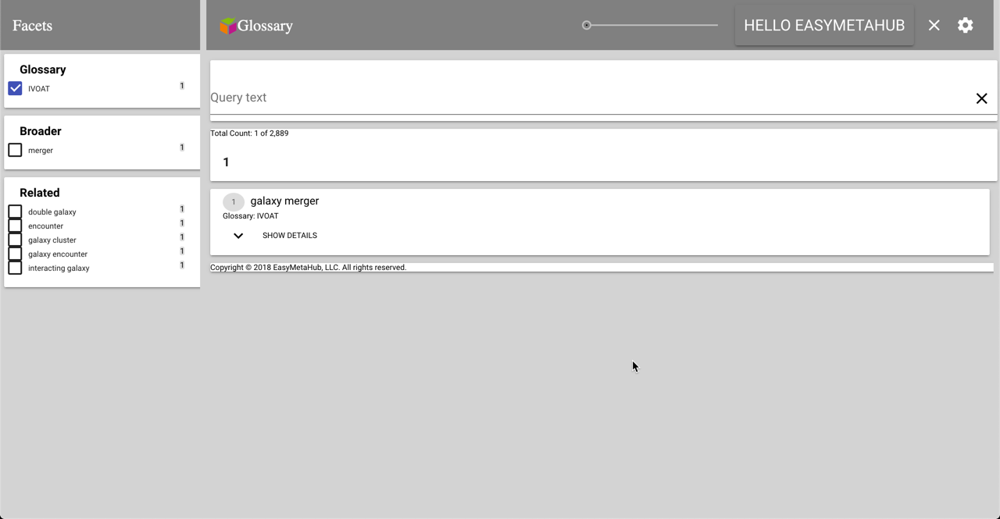
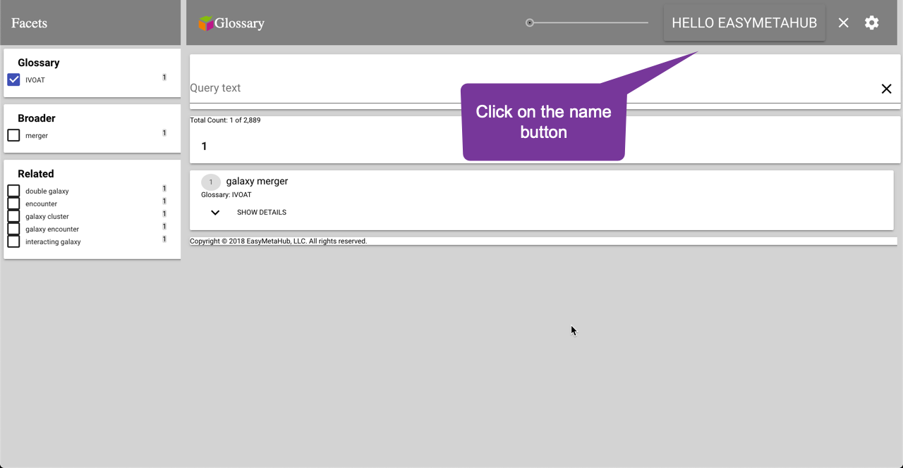
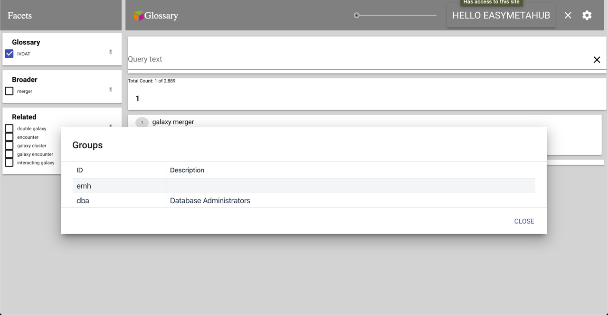
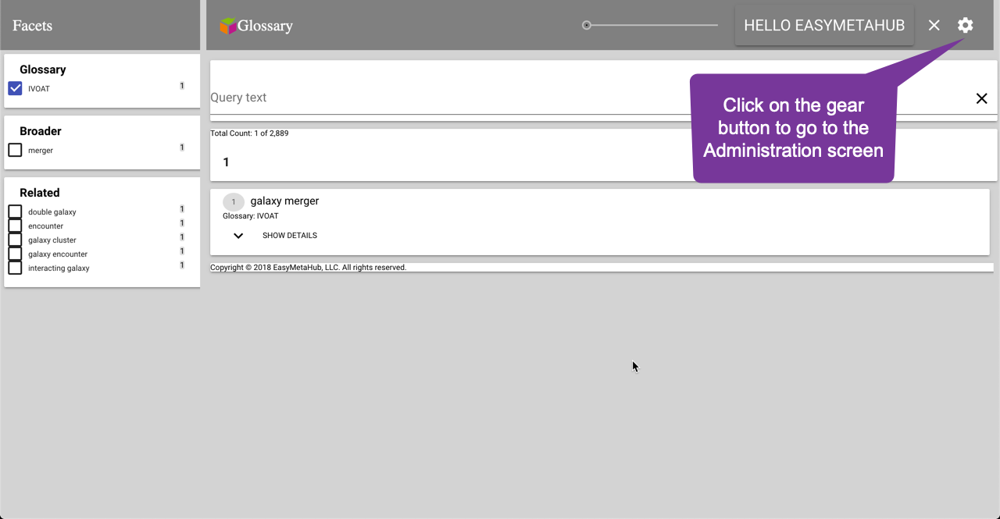
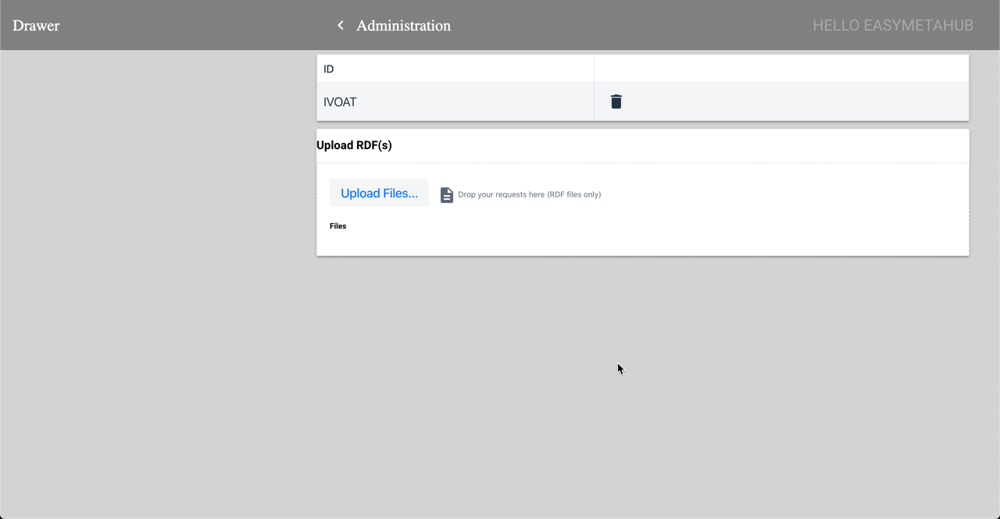

# Magellan AI Glossary for an eXist-db project

## Introduction

This application is a SKOS glossary manager and faceted search application that can 
manage multiple glossaries.  It is intended for organizations that need to manage
one or more glossaries.


There a many projects out there that do not require the power of MarkLogic and the licensing fees for it as well.  
[http://history.state.gov](http://history.state.gov) is one such project.  It has been using eXist-db as its hosting platform.

It was created as an easily customizable search application.  It abstracts out the
common code for faceted search and gives an easy development interface to customize
for uses other than a glossary manager.

#### About the author

[Loren Cahlander](https://www.linkedin.com/in/lorencahlander/) is the creator of
this tool and the [sister glossary application](https://github.com/magellan-ai-glossary/magellan-marklogic-glossary)
for MarkLogic.

#### Consulting 
[Magellan AI](https://magellanmeta.ai) is available for consulting in developing your
own customization of this tool.


## Development

### Requirements

* JDK 17
* Gradle 8.x — [https://gradle.org/install/](https://gradle.org/install/)
* npm / Node 20+ — [https://nodejs.org/](https://nodejs.org/)

### Building

Build the full XAR (XQuery + resources + Lit 3 public and admin frontends):

```
gradle buildXAR
```

The build output is in the ```build``` directory.

The legacy Polymer 3 sources under `src/main/polymer/` and the `polymer-cli`
dependency were removed in Phase 2d. The Lit ports live under
`src/main/lit/base/` and `src/main/lit/admin/`.

### Customization

The customizations for this project template are in:

- src/main/xquery/modules/custom/custom.xqm
- src/main/resources/collection.xconf
- src/main/lit/base/src/result-item.ts

## Basic installation and getting started is here:

Download version 5 of eXist-db following the instructions here: 
[http://exist-db.org/exist/apps/doc/basic-installation](http://exist-db.org/exist/apps/doc/basic-installation)

Version 5 of eXist-db is required for the faceting feature.

The initial view when you open your browser to 
[http://localhost:8080](http://localhost:8080) is:


Click login and usee the username admin with no password.


You will then see the page 


Select the 'Package Manager'


Click on 'Upload' and select magellan-glossary-0.9.0-alpha.3.xar


The Magellan AI Glossary shows up in the installed list.


Close the dialog and you will get this:



Type *Galaxy* in the search bar.



You can then select a facet to narrow the search results.  You can also expand a result item by selecting *Show Details*



If you select one of the buttons for *Related*, *Broader*, or *Narrower*, then you will be hyperlinked to that *Concept*



## Authentication and Authorization

This glossary manager in searchable as a *guest*.  In order to manage the glossaries, then you need to go the the *Administration* screen.  Click on *HELLO GUEST*.



This page shown the user as logged in.



Click on the username to get details of the user.



The details about the user show up in a dialog, including the groups that the user is part of.



## Administration

In order to go to the administration screen, you need to be logged in as part of the *emh* group and click on the *gear* icon.



This page shows the list of glossaries that are loaded and the ability to load more glossaries.



You can delete a glossary by clicking on the trash can by the name.  You can add glossaries by uploading RDF files containing either SKOS or SKOS-XL.

Sample glossaries are in the local `samples/` folder, including `IVOAT.rdf` and
`W3C-SKOS-Primer-Animal.rdf`.

You can check RDF/XML compatibility before upload with:

```bash
python3 tools/rdf_compat_check.py samples/*.rdf
```

Click on the chevron next tothe Administration header to return the the search page.


## Donation

If you find this template application useful, then I would appreciate a contribution to the development through PayPal to loren@magellanmeta.ai
