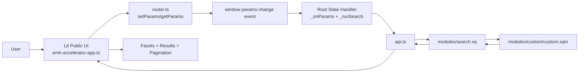
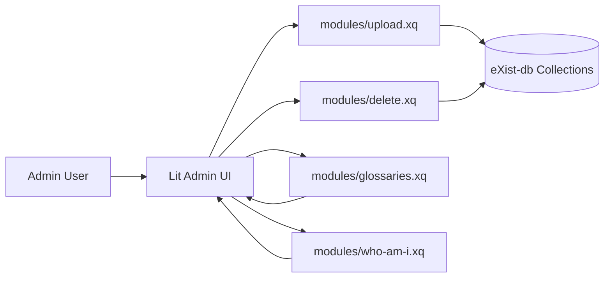
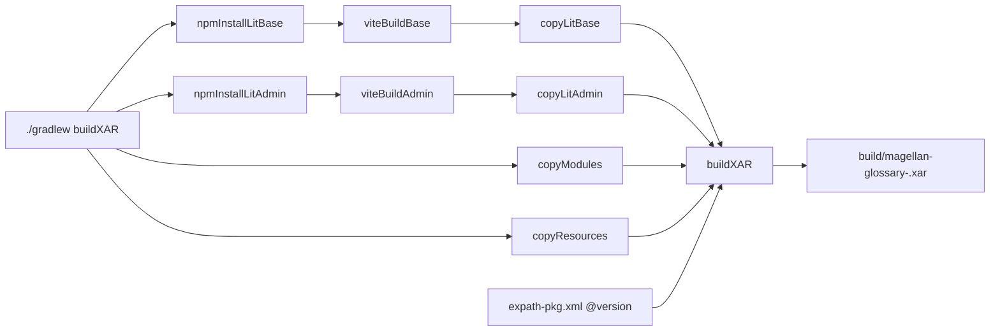

# Architecture Overview

This document describes the selected implementation architecture for this eXist-db search template.

## Goals

- Keep search application behavior reusable across domains.
- Separate domain customization from shared search infrastructure.
- Package everything as an installable eXist-db XAR.

## High-Level Components

- `Public UI (Lit 3)`: `src/main/lit/base/`
- `Admin UI (Lit 3)`: `src/main/lit/admin/`
- `XQuery API Modules`: `src/main/xquery/modules/`
- `Domain Customization`: `src/main/xquery/modules/custom/custom.xqm`
- `eXist Resource/Metadata`: `src/main/resources/`
- `Build and Packaging`: `build.gradle`

## Request Flow (Public Search)



1. User enters text or toggles a facet in the Lit UI.
2. UI updates URL params through `router.ts` (`setParams`).
3. Root app (`emh-accelerator-app.ts`) listens for `params-change`.
4. Root app calls backend endpoint `modules/search.xq`.
5. Backend composes results/facets (including custom mapping logic).
6. JSON response returns to UI.
7. UI renders facets, result cards, and pagination.

## Admin Flow



1. Admin user opens the admin frontend (`src/main/lit/admin/`).
2. Admin uploads RDF glossary files or deletes loaded glossaries.
3. Admin operations call XQuery module endpoints:
   - `upload.xq`
   - `delete.xq`
   - `glossaries.xq`
4. Search index/query behavior reflects updated data.

## Frontend Structure (Public UI)

- `emh-accelerator-app.ts`: root state, URL param sync, search requests.
- `facet-card.ts` / `facet-selector.ts`: facet rendering and toggle events.
- `result-item.ts`: result card, snippets, detail expansion, semantic relation chips.
- `result-item-button.ts`: relation chip clicks drive updated search params.
- `emh-pagination.ts`: pagination events and offset updates.
- `api.ts`: fetch wrapper for backend calls.
- `router.ts`: query parameter read/write and history events.

## Backend Structure

Core module responsibilities:

- `search.xq`: executes query/faceting and returns result payload.
- `upload.xq`: handles glossary RDF upload/processing.
- `delete.xq`: removes loaded glossary datasets.
- `glossaries.xq`: lists loaded glossaries.
- `who-am-i.xq`: user identity/group info for UI auth behavior.
- `custom/custom.xqm`: domain-specific extraction, mapping, and response shaping.

## Customization Boundaries

The template is designed so most projects only need targeted changes:

- Domain query/result shaping: `src/main/xquery/modules/custom/custom.xqm`
- Indexing/faceting config: `src/main/resources/collection.xconf`
- Result presentation: `src/main/lit/base/src/result-item.ts`
- Interaction/state UX: `src/main/lit/base/src/emh-accelerator-app.ts`

## Search State Model

Public search behavior is URL-param driven:

- `q`: query text
- `facets`: selected facet tokens (`~~` separator format)
- `start`: pagination offset
- `pagelength`: page size

Because state is in URL params, search behavior supports:

- reproducible/shareable links
- browser back/forward navigation
- clean event-driven updates (`params-change`)

## RAG API Contract

These endpoints form the retrieval contract when this app is used as the retrieval layer for RAG.

| Endpoint | Method | Query/Form Params | Response Shape | RAG Use |
|---|---|---|---|---|
| `modules/search.xq` | `GET` | `q`, `facets`, `start`, `pagelength`, optional `debug` | `{ total, available, facets, results }` where each result includes `concept`, `snippets`, `uri`, `glossary`, `score` | Primary grounded retrieval |
| `modules/glossaries.xq` | `GET` | none | JSON array of glossary names | Corpus discovery and scope filters |
| `modules/upload.xq` | `POST` (multipart) | form field `my-attachment` (one or more files) | `{ results: [{ responseFilename, messages[] }] }` | Ingestion/update of retrieval corpus |
| `modules/delete.xq` | `GET` | `glossary` | `{ success: true }` | Corpus maintenance and lifecycle |
| `modules/who-am-i.xq` | `GET` | optional `user` | user identity/group JSON | Auth-aware admin workflows |

### Search Payload Notes

- `facets` parameter accepts one or more facet tokens separated by `~~`.
- A facet token uses `facet:value` format (with URI-encoding/quoting handled by helper logic).
- `results[].concept` carries taxonomy context (`term`, `definition`, `altLabel`, `related`, `broader`, `narrower`) for prompt grounding.

### RAG Retrieval Data Flow

1. Orchestrator receives user question.
2. Orchestrator calls `modules/search.xq` with `q` and optional `facets`.
3. Backend resolves taxonomy-grounded results and relation links.
4. Orchestrator assembles context from `results[].concept` and `results[].snippets`.
5. LLM receives grounded context for answer generation.

## Packaging and Versioning



- Build pipeline compiles both Lit apps with Vite.
- Gradle assembles XQuery + resources + built frontend assets into XAR.
- Package version source of truth is `src/main/resources/expath-pkg.xml` (`@version`).
- `build.gradle` reads that version to name the XAR consistently.

## Runtime Compatibility Targets

| Runtime | Status | Validation Focus |
|---|---|---|
| eXist-db 6.4.1 + Java 17 | Known baseline | Existing behavior reference point during migration checks. |
| eXist-db 7.0.0-beta3 + Java 21 | Migration target | Full-text relevance, facet counts, auth/group behavior, upload/delete flows. |

Recommended migration validation command:

```bash
cd /Users/lcahlander/IdeaProjects/emh-exist-glossary
python3 tools/exist_smoke_test.py --base-url "http://localhost:8080/exist/apps/magellan-glossary"
```

## Security/Authorization Model

- Guest users can search/browse.
- Admin controls are role-gated using group data from `who-am-i.xq`.
- UI conditionally exposes admin actions based on authenticated user groups.

## Design Trade-Offs

- Chosen: lightweight Lit components + XQuery modules for clear separation and low runtime overhead.
- Chosen: URL-driven state to keep behavior explicit and debuggable.
- Chosen: centralized domain logic in `custom.xqm` to reduce frontend coupling.
- Trade-off: some legacy endpoint contracts and facet token formats are preserved for compatibility.


